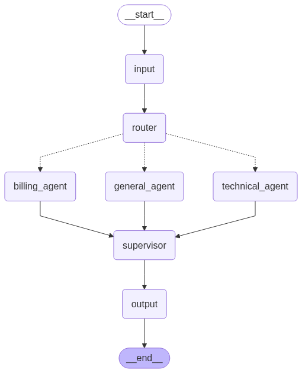
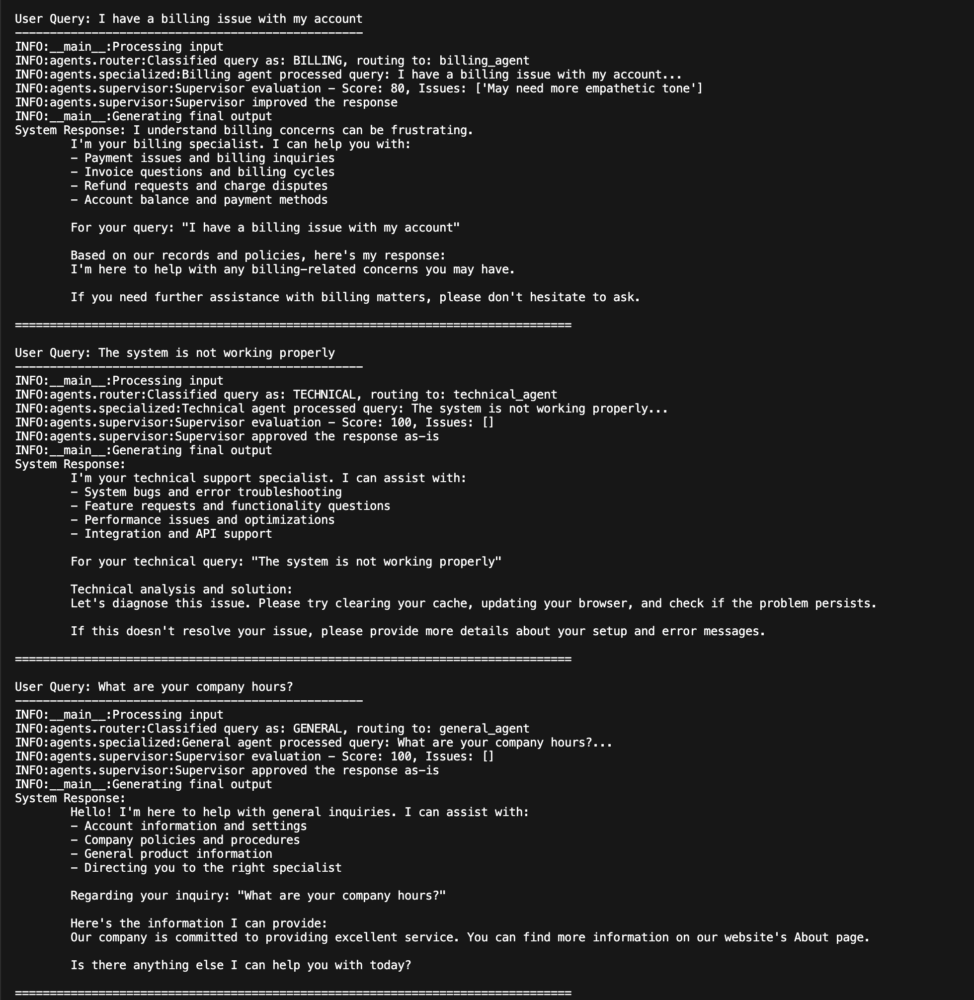

# Multi-Agent Customer Support System

A LangGraph-based multi-agent system that simulates a customer support workflow. The system intelligently routes user queries to specialized agents based on issue type (Billing, Technical, or General), with a Supervisor agent ensuring response quality.

## System Architecture

```
User Query → Input Node → Router Agent → Specialized Agent → Supervisor Agent → Final Response
                              ↓
                    [Billing | Technical | General]
```
## Workflow Diagram

Below is a visual representation of the system architecture:


### Components

- **Input Node**: Processes initial user queries
- **Router Agent**: Classifies queries and routes to appropriate specialists
- **Specialized Agents**:
  - **Billing Agent**: Handles payment, invoice, and billing-related queries
  - **Technical Agent**: Manages technical issues, bugs, and feature requests
  - **General Agent**: Processes general inquiries and company information
- **Supervisor Agent**: Performs quality assurance and edits responses as needed
- **Final Response Node**: Returns the approved response to the user


## Project Structure

```
multi_agent_test/
├── main.py                 # Main application entry point
├── agents/
│   ├── __init__.py
│   ├── router.py          # Query classification logic
│   ├── specialized.py     # Billing, Technical, and General agents
│   └── supervisor.py      # Quality assurance and response editing
├── tests/                  # Comprehensive test suite
│   ├── __init__.py
│   ├── conftest.py        # Test fixtures and configuration
│   ├── test_router.py     # Router agent tests
│   ├── test_specialized.py # Specialized agents tests
│   ├── test_supervisor.py # Supervisor agent tests
│   └── test_integration.py # End-to-end workflow tests
├── .env.example           # Environment configuration template
├── .gitignore
├── README.md
├── pytest.ini             # Test configuration
├── requirements.txt  # Testing dependencies
├── graph.png              # Auto-generated workflow diagram (in development mode)

```

## Features

- **Intelligent Query Routing**: Automatic classification of user queries
- **Specialized Response Handling**: Domain-specific agents for different query types
- **Quality Assurance**: Supervisor agent reviews and improves responses
- **Memory Functionality**: Agents maintain conversation history
- **Error Handling**: Comprehensive logging and error management
- **Graph Visualization**: Automatic generation of workflow diagram (graph.png) in development mode
- **Comprehensive Testing**: Full unit and integration test coverage with pytest
- **Extensible Architecture**: Easy to add new agent types or modify existing ones

## Setup Instructions

### Prerequisites

- Python 3.8+
- Virtual environment (already set up per requirements)

### Installation

1. **Clone and navigate to the project**:
   ```bash
   cd /path/to/multi_agent_test
   ```

2. **Activate the virtual environment**:
   ```bash
   source .venv/bin/activate  # On Windows: .venv\Scripts\activate
   ```

3. **Install dependencies** (if not already installed):
   ```bash
   pip install langgraph langchain-core python-dotenv
   
   # Optional: For graph visualization
   pip install pygraphviz
   
   # For testing (optional)
   pip install -r requirements-test.txt
   ```

4. **Environment Configuration**:
   ```bash
   cp .env.example .env
   # Edit .env file with your configuration if needed
   ```

### Configuration

#### Basic Setup (No External APIs Required)

The system works out-of-the-box with basic keyword-based classification and template responses. No external API keys are required for basic functionality.

#### Advanced Setup (Optional)

For enhanced functionality with LLM providers:

1. **OpenAI Integration**:
   ```bash
   # Add to .env
   OPENAI_API_KEY=your_openai_api_key_here
   ```

2. **Anthropic Integration**:
   ```bash
   # Add to .env
   ANTHROPIC_API_KEY=your_anthropic_api_key_here
   ```

3. **Gmail Configuration** (for notifications):
   ```bash
   # Add to .env
   GMAIL_USER=your_email@gmail.com
   GMAIL_PASSWORD=your_app_password_here
   ```

4. **Brave Search** (for web search capabilities):
   ```bash
   # Add to .env
   BRAVE_API_KEY=your_brave_search_api_key_here
   ```

## Usage

### Running the Demo

```bash
python main.py
```

This will run the system with three example queries demonstrating different agent types. In development mode (APP_ENV=development), this will also generate a `graph.png` file showing the workflow visualization.

```bash
(.venv) kpal@Kushs-macbook-pro-M2-Max multi_agent_test % python main.py
🤖 Multi-Agent Customer Support Chatbot
Type `q` or `exit` to quit the chat.
Type `reset` to start a new conversation.
==================================================

📈 Total Customers in System: 20

💬 Hello! I am your customer support assistant. Please tell me how I can help you today.
💡 Tip: Include your account ID (e.g., USER123456) or email for faster service.

👤 You: my name is kuldeep

🔄 Processing your request... (Session #1)
INFO:__main__:Graph visualization saved to graph.png
INFO:__main__:Processing input
INFO:agents.router:Classified query as: GENERAL, routing to: general_agent
INFO:utils.user_identifier:No customer identified from query
INFO:agents.specialized:General agent processed query: my name is kuldeep...
INFO:agents.supervisor:Supervisor evaluation - Score: 80, Issues: ['May not fully address query']
INFO:agents.supervisor:Supervisor improved the response
INFO:__main__:Generating final output

🤖 Assistant: Thank you for your inquiry. I could not find your account with the information provided. Please provide your account ID (e.g., USER123456) or email address so I can assist you better.

Please let me know if this does not fully address your question or if you need clarification on any point.

👤 You: my name is       "name": "Amanda Foster",

🔄 Processing your request... (Session #2)
INFO:__main__:Graph visualization saved to graph.png
INFO:__main__:Processing input
INFO:agents.router:Classified query as: GENERAL, routing to: general_agent
INFO:utils.user_identifier:No customer identified from query
INFO:agents.specialized:General agent processed query: my name is       "name": "Amanda Foster",...
INFO:agents.supervisor:Supervisor evaluation - Score: 80, Issues: ['May not fully address query']
INFO:agents.supervisor:Supervisor improved the response
INFO:__main__:Generating final output

🤖 Assistant: Thank you for your inquiry. I could not find your account with the information provided. Please provide your account ID (e.g., USER123456) or email address so I can assist you better.

Please let me know if this does not fully address your question or if you need clarification on any point.

👤 You: my email is amanda.foster@marketing.pro

🔄 Processing your request... (Session #3)
INFO:__main__:Graph visualization saved to graph.png
INFO:__main__:Processing input
INFO:agents.router:Classified query as: GENERAL, routing to: general_agent
INFO:utils.user_identifier:Found customer by email: amanda.foster@marketing.pro
INFO:agents.specialized:User identified: Amanda Foster (USER010234)
INFO:httpx:HTTP Request: POST https://api.openai.com/v1/chat/completions "HTTP/1.1 200 OK"
INFO:agents.specialized:General agent processed query: my email is amanda.foster@marketing.pro...
INFO:agents.supervisor:Supervisor evaluation - Score: 100, Issues: []
INFO:agents.supervisor:Supervisor approved the response as-is
INFO:__main__:Generating final output

🤖 Assistant: Hi Amanda,

Thank you for reaching out! I see that your email is indeed registered as amanda.foster@marketing.pro. If you have any specific questions or need assistance regarding your account or subscription, feel free to let me know!

I also noticed that your payment status shows as failed. If you need help resolving that issue, it may be best to reach out to our billing support team for more specialized assistance.

If there is anything else I can assist you with, please do not hesitate to ask!

Best regards,  
[Your Name]  
Customer Support Team

👤 You: I have an issue of payment

🔄 Processing your request... (Session #4)
INFO:__main__:Graph visualization saved to graph.png
INFO:__main__:Processing input
INFO:agents.router:Classified query as: BILLING, routing to: billing_agent
INFO:utils.user_identifier:No customer identified from query
INFO:agents.specialized:Billing agent processed query: I have an issue of payment...
INFO:agents.supervisor:Supervisor evaluation - Score: 80, Issues: ['May need more empathetic tone']
INFO:agents.supervisor:Supervisor improved the response
INFO:__main__:Generating final output

🤖 Assistant: I understand billing concerns can be frustrating. Hello! To provide you with personalized assistance, I will need to identify your account first. Please provide your account ID (e.g., USER123456) or email address.

👤 You: amanda.foster@marketing.pro

🔄 Processing your request... (Session #5)
INFO:__main__:Graph visualization saved to graph.png
INFO:__main__:Processing input
INFO:agents.router:Classified query as: GENERAL, routing to: general_agent
INFO:httpx:HTTP Request: POST https://api.openai.com/v1/chat/completions "HTTP/1.1 200 OK"
INFO:agents.specialized:General agent processed query: amanda.foster@marketing.pro...
INFO:agents.supervisor:Supervisor evaluation - Score: 100, Issues: []
INFO:agents.supervisor:Supervisor approved the response as-is
INFO:__main__:Generating final output

🤖 Assistant: Subject: Assistance with Your Account

Hi Amanda,

Thank you for reaching out! I hope you are having a great day.

I noticed that your recent payment status is marked as "failed." This could be why you are experiencing issues with your Premium Plan subscription. To resolve this, I recommend checking your payment details to ensure everything is up to date. You can usually do this in your account settings.

If the issue persists or if you have any questions about the billing process, our billing department would be more than happy to assist you further. You can reach them directly, or let me know if you’d like me to escalate this for you.

Additionally, if there is anything else I can help you with or if you have any other questions, feel free to ask!

Best regards,

[Your Name]  
Customer Support Representative  
amanda.foster@marketing.pro  
Account ID: USER010234

👤 You: amanda.foster@marketing.pro I have billing issue

🔄 Processing your request... (Session #6)
INFO:__main__:Graph visualization saved to graph.png
INFO:__main__:Processing input
INFO:agents.router:Classified query as: BILLING, routing to: billing_agent
INFO:utils.user_identifier:Found customer by email: amanda.foster@marketing.pro
INFO:agents.specialized:User identified: Amanda Foster (USER010234)
INFO:httpx:HTTP Request: POST https://api.openai.com/v1/chat/completions "HTTP/1.1 200 OK"
INFO:agents.specialized:Billing agent processed query: amanda.foster@marketing.pro I have billing issue...
INFO:agents.supervisor:Supervisor evaluation - Score: 100, Issues: []
INFO:agents.supervisor:Supervisor approved the response as-is
INFO:__main__:Generating final output

🤖 Assistant: Subject: Assistance with Your Billing Issue

Dear Amanda,

Thank you for reaching out regarding your billing issue. I see that your last payment, scheduled for June 28, 2024, has unfortunately failed. As a result, your current balance is $29.99.

To resolve this, please check your payment method ending in ****-4681 to ensure it is valid and has sufficient funds. You can update your payment information directly through your account settings.

Your next billing date is set for August 28, 2024, so addressing this issue promptly will ensure your Premium Plan remains active without interruption.

If you need further assistance or have additional questions, please do not hesitate to ask.

Best regards,

[Your Name]  
Billing Specialist  
Customer Support Team  

👤 You: q

🤖 Assistant: Thank you for using our support system. Have a great day!
```



### Using the System Programmatically

```python
from main import run_customer_support_system

# Process a user query
response = run_customer_support_system("I need help with my billing")
print(response)
```

### Example Queries

- **Billing**: "I have a billing issue with my account", "Need a refund for my order"
- **Technical**: "The system is not working", "I found a bug in the application"
- **General**: "What are your company hours?", "How do I update my account?"

## System Workflow

1. **Input Processing**: User query is received and prepared
2. **Query Classification**: Router agent analyzes the query and determines the appropriate specialist
3. **Specialized Handling**: The selected agent (Billing, Technical, or General) processes the query
4. **Quality Assurance**: Supervisor agent evaluates the response for:
   - Completeness
   - Accuracy
   - Professional tone
   - Clarity
5. **Response Improvement**: If needed, the supervisor edits or enhances the response
6. **Final Output**: The approved response is returned to the user

## Memory System

Each specialized agent maintains conversation history:
- Stores previous queries and responses
- Provides context for follow-up questions
- Enables personalized interactions

## Logging

The system includes comprehensive logging:
- Agent routing decisions
- Processing status
- Error handling
- Quality assurance evaluations

## Extending the System

### Adding New Agent Types

1. Create a new agent class in `agents/specialized.py`
2. Add routing logic in `agents/router.py`
3. Update the workflow in `main.py`

### Customizing Response Templates

Modify the `response_template` in each agent class to match your organization's tone and style.

### Integrating External APIs

Add API calls in the agent's `generate_response` method for enhanced functionality.

## Troubleshooting

### Common Issues

1. **Import Errors**: Ensure all dependencies are installed and virtual environment is activated
2. **Classification Issues**: Check keyword lists in router agent
3. **Memory Issues**: Verify memory limits in configuration

### Debugging

Enable detailed logging:
```python
import logging
logging.basicConfig(level=logging.DEBUG)
```

## Testing

The project includes a comprehensive test suite covering all components:

### Running Tests

```bash
# Run all tests
pytest

# Run with coverage report
pytest --cov=agents --cov=main

# Run specific test categories
pytest -m unit          # Unit tests only
pytest -m integration   # Integration tests only

# Run tests for specific components
pytest tests/test_router.py
pytest tests/test_specialized.py
pytest tests/test_supervisor.py
pytest tests/test_integration.py

# Verbose output with details
pytest -v

# Run tests and generate HTML coverage report
pytest --cov=agents --cov=main --cov-report=html
```

### Test Structure

- **Unit Tests**: Test individual components in isolation
  - `test_router.py`: Router agent classification logic
  - `test_specialized.py`: All specialized agent functionality
  - `test_supervisor.py`: Supervisor quality assurance logic

- **Integration Tests**: Test complete workflows end-to-end
  - `test_integration.py`: Full system workflow testing

### Test Configuration

- `pytest.ini`: Test runner configuration
- `conftest.py`: Shared test fixtures and utilities
- `requirements-test.txt`: Testing dependencies

### Writing New Tests

When adding new features, include tests following the existing patterns:

```python
# Unit test example
def test_new_agent_functionality():
    agent = NewAgent()
    result = agent.process_query("test query")
    assert result is not None
    assert "expected_content" in result

# Integration test example  
def test_new_workflow_integration():
    response = run_customer_support_system("test query")
    assert response != ""
    assert "technical difficulties" not in response.lower()
```

## Development

### Adding New Features

1. **Implement the feature** in the appropriate module
2. **Add unit tests** to verify component functionality
3. **Add integration tests** to verify end-to-end behavior
4. **Update documentation** in README.md
5. **Run the full test suite** to ensure no regressions

### Testing New Queries

Add test queries to the main.py file or create separate test files:

```python
test_queries = [
    "Your test query here",
    # Add more test cases
]
```

### Contributing

1. Follow the existing code structure
2. Add appropriate logging
3. Update documentation for new features
4. Test with various query types

## License

This project is for educational and demonstration purposes.